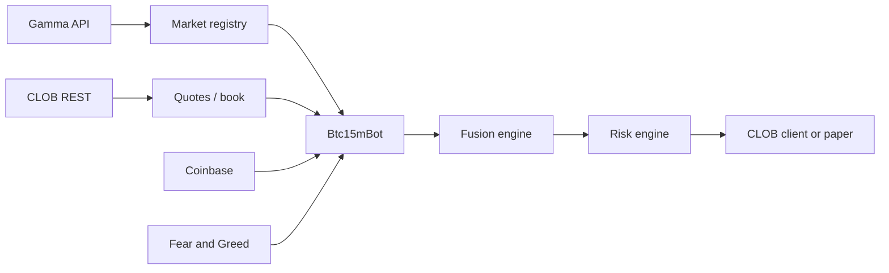

# Polymarket BTC 15-Minute Trading Bot

[](https://nodejs.org/)
[](https://opensource.org/licenses/MIT)
[](https://polymarket.com)
[](https://redis.io/)

TypeScript bot for **Polymarket 15-minute BTC up/down markets**: Gamma market discovery, CLOB quotes, weighted signal fusion, risk checks, and optional live orders via `@polymarket/clob-client`.

## Prerequisites

- Node.js 20+
- Redis (optional) — `btc_trading:simulation_mode` toggle
- Polymarket wallet private key (`POLYMARKET_PK`) for live trading; CLOB API credentials are derived each run unless you set `POLYMARKET_API_*` in `.env`

## Quick start

### Step 1: Install


```bash
git clone https://github.com/LacaveSeb/polymarket-trading-bot-example.git
cd polymarket-trading-bot-example
npm install
npm run bot              # development (tsx)
```

Production build:

```bash
npm run build
npm start
```

## Configuration

Create `.env` in the **repository root** (same folder as `package.json`). The app loads it via `process.cwd()`.

```env
POLYMARKET_PK=
# Optional — override auto-derived CLOB credentials:
# POLYMARKET_API_KEY=
# POLYMARKET_API_SECRET=
# POLYMARKET_PASSPHRASE=
POLYMARKET_FUNDER=
POLYMARKET_CHAIN_ID=137

REDIS_HOST=localhost
REDIS_PORT=6379
REDIS_DB=2

MARKET_BUY_USD=1
LOG_LEVEL=info
GRAFANA_METRICS_PORT=8000
```

## CLI

| Flag | Description |
|------|-------------|
| `--live` | Live trading (requires credentials; real funds at risk) |
| `--no-grafana` | Disable Prometheus `/metrics` server |
| `--test-mode` | Forces simulation + shorter paper-trade horizon |

Default is **simulation** (paper trades, `paper_trades.json`).

## Architecture (high level)



## Project structure

```text
├── package.json
├── tsconfig.json
├── src/
│   ├── index.ts
│   ├── app/                 # Gamma + main bot loop
│   ├── config/
│   ├── core/strategy-brain/
│   ├── data-sources/
│   ├── domain/
│   ├── execution/
│   ├── feedback/
│   └── monitoring/
└── grafana/                 # dashboard.json (import manually in Grafana)
```

## Monitoring

With Grafana exporter enabled, metrics are exposed at `http://localhost:8000/metrics` (Prometheus format).

## Disclaimer

Trading involves significant risk. This software is for educational purposes. Past performance does not guarantee future results. The authors are not responsible for financial losses. Use simulation mode first; only trade amounts you can afford to lose.

## Acknowledgments

- [Polymarket](https://polymarket.com) — CLOB and markets  
- [clob-client](https://github.com/Polymarket/clob-client) — TypeScript SDK  